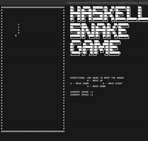

# Snake With Haskell

## Authored By: Darian Hodzic, Aierken Shalayiding

## Demo

## How to Play the Game
1. Clone the project via `git clone` in a local folder.
2. Open your terminal and change your directory via `cd` so that you're in the `snake` folder.
3. Run the command `stack runhaskell src/Lib.hs` and the game will begin.
4. Follow the onscreen directions and play the game!

## Summary Description

Our project goal was to create a terminal-based snake game which allows for
controlling movement and interacting with the game environment through multiple game states such as start state, running state, and end state. In this game, interaction with the environment includes collision with the borders of the board as well as eating food and increasing the length of the snake. 

## Additional Details
- Our project utilizes a few dependencies added in the `dependencies` section of the `package.yaml` file. Here are the ones we used and reasons why for each:
  1. `random` for generating random values when determining possible food spawn locations on the game board.
  2. `ansi-terminal` for hiding the cursor on the terminal (we utilized `hideCursor` within `main`).
  3. `process` for clearing the screen via `system "clear"`
  4. `QuickCheck` for writing test case properties that can be run to test the correctness of our project.

## Code Structure 
The code is structured in a manner that follows our order of approach mentioned in the execution summary.

Our datatypes, game status, border/board, rendering, and code functions for corresponding elements of the game are all organized towards the top. What follows is our code for random generation of food items and then our core game loop and main functions. The main component of our code is the function `gmLoop` which is where the majority of the core logic is taking place as we recurse on it.
